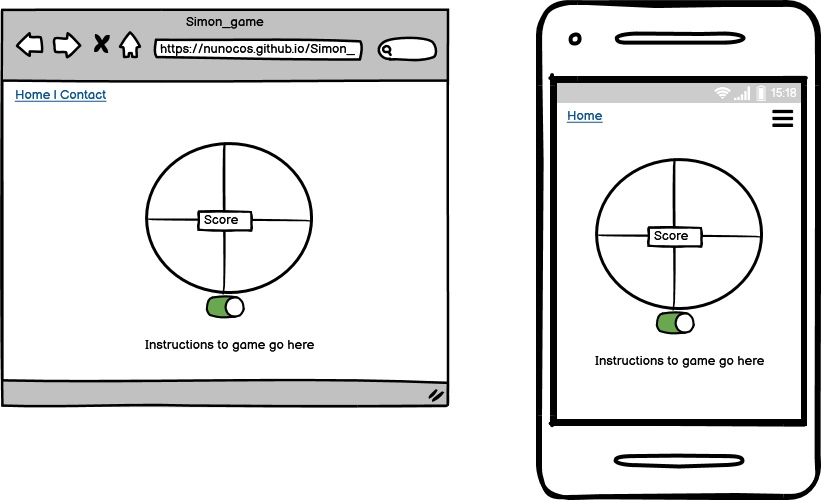
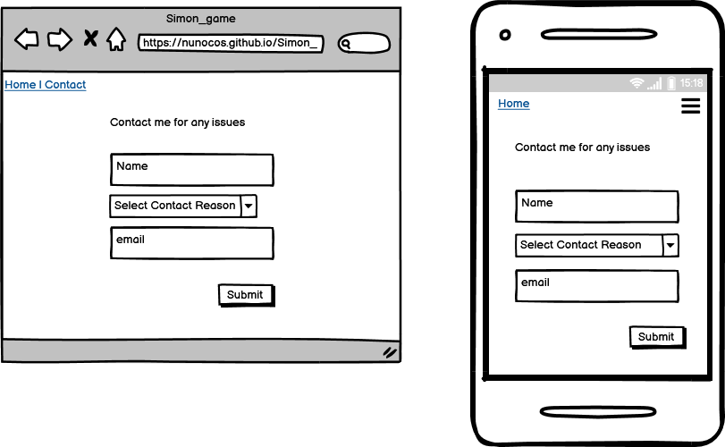

# Simon Game

Hello and welcome to my second milestone project. For this project I chose to create my version of the simon game, as I like the attention to detail and love the challenge I think that this would be the right selection for me.
The Simon Game is a memory game and was invented by Ralph H. Baer and Howard J. Morrison in 1978.
The project is developed using HTML, CSS and JavaScript.

[**View Simon Game website here!**](https://nunocos.github.io/Simon_game/)

---

## Description
Simon plays a random sequence for the player to repeat using colours and sounds. The player has to repeat the same sequence as Simon to win the game, this sequence will get longer and longer if the player gets the right sequence, if he gets it wrong the counter will get to 0 and player needs to start over.

---

## UX and Features

As the game as a colorfoul layout that's exactly how the layout should seem, will have a different background to enhance the target area.

#### 1. Strategy
The aim of this project is to create interactivity between the user and the game.

#### 2. Goals
The goal of this website is to give a good experience to the user and to the user to have fun with this interactive game.

#### 3. Scope
The website is designed to be responsive so that users can also interact with it on mobile.

---

#### 4. Features

* Navbar
    * Basic Navbar, navbar taken from the previous milestone project and adapted to this project. Only has 2 list items on this case, the homepage and contact from

* Homepage
    * On the homepage there will be displayed only the game and instructions.

* Simon Game
    * On/Off button so that the user can initiate the game;
    * Score box with counter so that the user can see the current score.

* Contact Form Page
    * Basic Bootstrap contact form with Email API to forward the contact from the users to me.

---

#### 5. Skeleton

* Wireframe was created using [Balsamiq](https://balsamiq.com/)

##### Home Page

##### Contact Us

---

## Technologies Used

##### Languages Used

* [HTML5](https://en.wikipedia.org/wiki/HTML5)
* [CSS3](https://en.wikipedia.org/wiki/CSS)
* [JavaScript](https://en.wikipedia.org/wiki/JavaScript)

##### Frameworks, Libraries & Programs Used

* [Git](https://git-scm.com/)
* [Bootsrap](https://getbootstrap.com/)
* [GitHub](https://github.com/)
* [Balsamiq](https://balsamiq.com/)
* [Google Fonts](https://fonts.google.com/)
* [Font Awesome](https://fontawesome.com/)
* [Coolors](https://coolors.co/ebf5df-bad4aa-d4d4aa-edb458-e8871e)
* [Chrome DevTools](https://developers.google.com/web/tools/chrome-devtools)
* [Autoprefixer CSS](https://autoprefixer.github.io/)
* [JQuery](https://jquery.com/)

---

##### Validation

[W3C Markup Validator](https://validator.w3.org/)
* Index page - 
* Contact-us page -

[W3C CSS Validator](https://jigsaw.w3.org/css-validator/)
* 

[Google's Mobile-Friendly Test](https://search.google.com/test/mobile-friendly)
* 

## Deployment

##### GitHub Pages

1. A local project was created in GitHub with a new repository called 'Mind-Gym-Project'
2. The project had regular push and detailed commits which were pushed to the GitHub website before deployment
3. The project was deployed by logging in to GitHub and locating the [GitHub Repository](https://nunocos.github.io/Simon_game/)
4. At the top of the Repository (not top of page), locate the "Settings" Button on the menu and click
5. Scroll down the Settings page until the "GitHub Pages" Section was found
6. Under "Source", click the dropdown called "None" and select "Master Branch"
7. The page will refresh and you will be brought back to the top of the settings page
8. Scroll back down through the page to locate the now published site [link](https://nunocos.github.io/Simon_game/) in the "GitHub Pages" section
9. The code can be run locally through clone or download, you can do this by opening the repository, clicking on the code button and then selecting either 'clone' or 'download'
10. The Clone option provides a url, which you can use on your desktop IDE
11. The Download option gives you a link so that you can download the zip file so that you can unzip it in your local machine
---